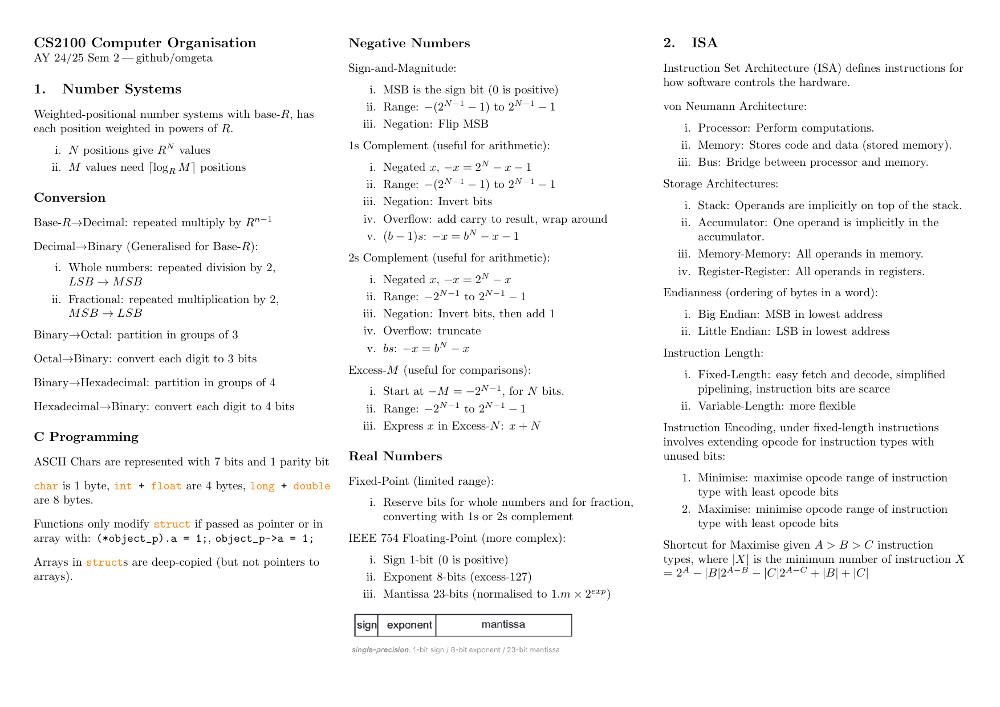
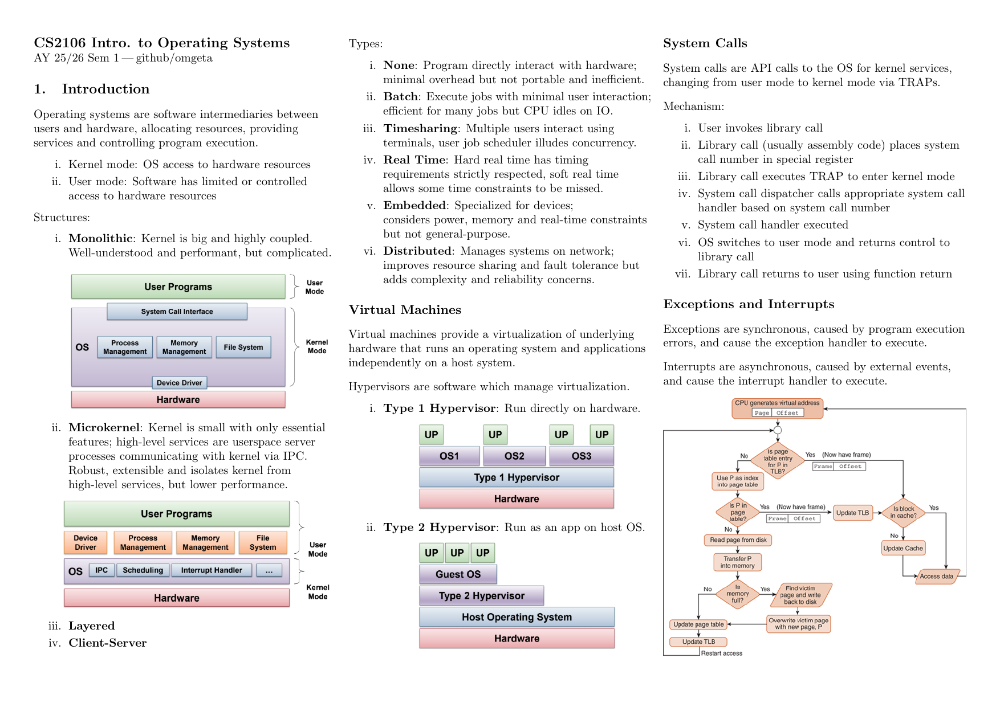
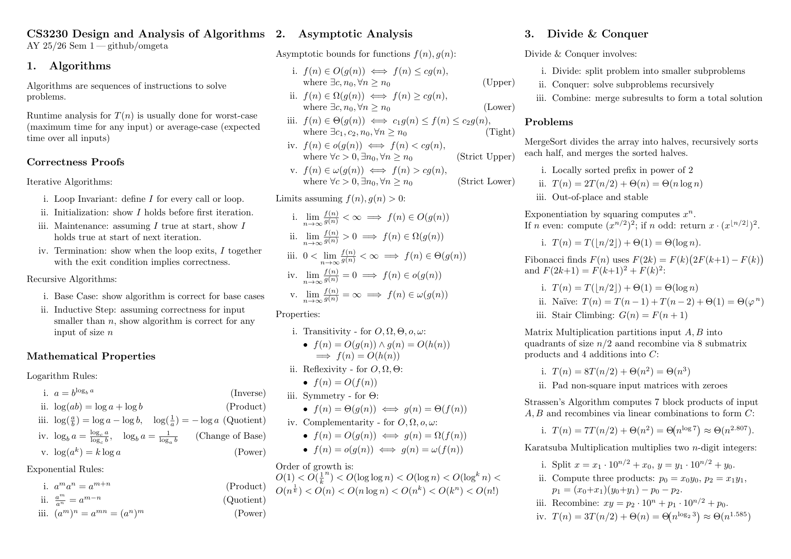

# nus-notes

<table> <tr> <td width="33%" align="center"> <a href="archive/cs2100/cheatsheet/cheatsheet.pdf">  </a> </td> <td width="33%" align="center"> <a href="archive/cs2106/cheatsheet/cheatsheet.pdf">  </a> </td> <td width="33%" align="center"> <a href="archive/cs3230/cheatsheet/cheatsheet.pdf">  </a> </td> </tr> <tr> <td align="center"><b>CS2100</b><br>Computer Organisation</td> <td align="center"><b>CS2106</b><br>Introduction to Operating Systems</td> <td align="center"><b>CS3230</b><br>Design and Analysis of Algorithms</td> </tr> </table>

Notes, cheatsheets, tutorials, labs, and selected coursework during my 2.5 years studying Computer Science at the National University of Singapore.

Most of these materials were made for revision and open-book exams. Completed modules are archived under [`archive/`](archive/).

> These notes reflect the semesters in which I took each module. Content, syllabus, and assessment formats may have changed since then.

## Modules

|                              |                              |                              |
| :--------------------------- | :--------------------------- | :--------------------------- |
| [`CS1231S`](archive/cs1231s) | [`CS2030S`](archive/cs2030s) | [`CS2040S`](archive/cs2040s) |
| [`CS2100`](archive/cs2100)   | [`CS2103T`](archive/cs2103t) | [`CS2106`](archive/cs2106)   |
| [`CS2109S`](archive/cs2109s) | [`CS3210`](archive/cs3210)   | [`CS3211`](archive/cs3211)   |
| [`CS3230`](archive/cs3230)   | [`CS3236`](archive/cs3236)   | [`EL1101E`](archive/el1101e) |
| [`GEA1000`](archive/gea1000) | [`GEC1040`](archive/gec1040) | [`IS1108`](archive/is1108)   |
| [`MA1521`](archive/ma1521)   | [`MA1522`](archive/ma1522)   | [`ST2334`](archive/st2334)   |

Depending on the module, folders may contain:

- **cheatsheets** — condensed notes prepared for revision or open-book exams
- **tutorials** — selected tutorial work and solutions
- **labs** — selected lab exercises
- **assignments** — selected coursework and supporting material
- **source files** — LaTeX and other files used to produce the notes

## Structure

```text
nus-notes/
├── archive/
│   ├── cs1231s/
│   ├── cs2030s/
│   ├── ...
│   └── st2334/
├── template/
└── todo/
```

Each completed module is kept under archive/<module-code>.

## Disclaimer

Many of the cheatsheets and notes in this repository are written in LaTeX, with a workflow inspired by:

@gillescastel
@SeniorMars
@reidenong

The goal is to keep notes compact, searchable, and useful during both revision and open-book assessments.

These are personal notes and may contain mistakes, omissions, or material specific to the semester in which I took the module. They are not official NUS course materials.

Selected tutorials, labs, and assignments are included for reference. Please follow NUS academic integrity requirements and do not submit material from this repository as your own work.
